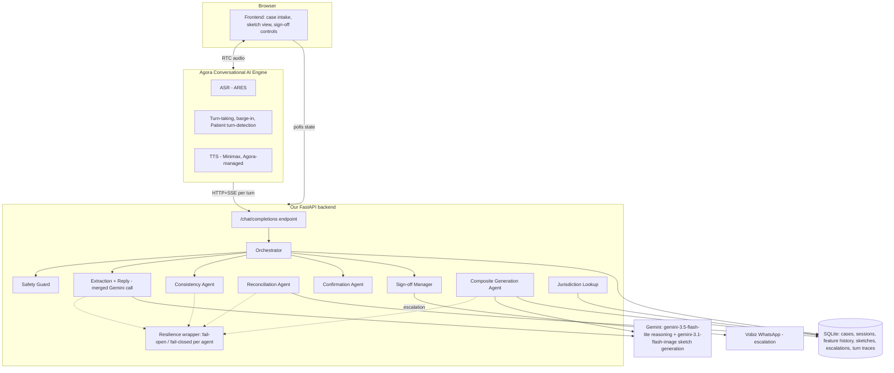

# Composite Sketch Assistant

A voice-only AI that helps a witness build a composite sketch of a crime suspect through natural conversation, refining it live as they correct details, and reconciling multiple independent witnesses into one case file. Built for **Build with Agora** (Track 3: Civic & Government Services).

## Problem being solved

When a crime has no photo of the suspect, an investigation depends on a witness verbally describing what they saw. Today that means either a scarce, expensive human forensic sketch artist, or a slow, form-based intake process that loses the nuance of natural description ("his eyes were kind of close together, not really almond-shaped, more round"). Neither scales, and neither handles the case where multiple witnesses saw the same person and need their accounts cross-checked rather than just averaged together.

This project lets a witness describe a suspect out loud, the same way they would to a person, while an AI builds and refines a composite sketch live, catches contradictions in their own account, and , when there are two witnesses , flags where their descriptions actually disagree instead of silently picking one.

## Target user

- **Primary:** a witness to a crime, describing a suspect they have no photo of, often under stress and without patience for a multi-page form.
- **Secondary:** a police caseworker or officer, who reviews the draft sketch, resolves any flagged conflicts between witnesses, and signs off before it becomes part of a case file.
- Designed for field conditions: natural, unstructured speech; interruptions and self-corrections; no assumption of digital literacy or typing.

## Architecture



**Why this shape:** Agora owns the entire real-time voice layer (transport, ASR, turn-taking, barge-in, TTS) so our backend never touches audio directly , it only has to look like an OpenAI-compatible `/chat/completions` endpoint. Every call into that endpoint is treated as stateless; the database, not Agora's own history replay, is the single source of truth for a session's state.

## How Agora Conversational AI is used

Agora Conversational AI Engine is the **primary and only** live voice channel , not a secondary feature. Specifically:

- **ASR**: Agora's own ARES vendor (zero third-party account needed), configured for `en-US`.
- **LLM**: a custom endpoint (our own server, reached via a code-defined REST config, never through Agora's Console/Studio UI), so our multi-agent pipeline runs on every turn.
- **TTS**: Minimax, using Agora's managed-credential mode (`credential_mode: "managed"`), so no separate vendor account was needed for the demo.
- **Turn detection**: explicitly configured to the "Patient" preset (480ms silence before ending a turn, up to 4s semantic wait, 1000ms padding at the start of speech) rather than left on undocumented defaults , this was a real, live-debugged fix after testing showed real speech was intermittently producing empty transcripts under default timing.
- **Barge-in**: native Agora voice-activity detection (`enable_aivad`), no custom interruption logic needed on our side.
- The agent instance itself is created entirely through Agora's REST API (`CreateConvoAIAgent`), with the full ASR/LLM/TTS/turn-detection configuration defined as versioned code in `backend/app/services/agora_rest.py` , never configured by hand in the Console.

## External APIs, LLMs, and speech providers used

| Purpose | Provider | Notes |
|---|---|---|
| Real-time voice transport, ASR, turn-taking, TTS orchestration | **Agora Conversational AI Engine** | ASR = ARES (Agora-native); TTS = Minimax (Agora-managed credential) |
| Reasoning (feature extraction + conversational reply) | **Google Gemini** (`gemini-3.5-flash-lite`) | One merged call per turn for latency; structured output |
| Composite sketch generation and iterative editing | **Google Gemini** (`gemini-3.1-flash-image`) | Verified live: consistent multi-turn edits (same face, only the requested feature changes) |
| Human escalation delivery | **Vobiz** (WhatsApp Business API) | Optional , falls back to an in-app banner if not configured |
| Tunnel for local dev to reach Agora's cloud | **ngrok** | Development-mode only, documented as such, not a production claim |

## Conversational AI capabilities demonstrated

- **Barge-in / interruption handling** , native Agora, with a tuned turn-detection preset for reliable natural-speech pickup
- **Natural turn-taking** , native Agora
- **Correction recovery** , the Consistency Agent detects when a new statement contradicts an already-locked feature and asks a deterministic, verbatim-quoting clarifying question (not left to chance / model discretion, since this maps to a mandatory requirement)
- **Session-level memory** , every parameter change is a real, persisted `FeatureVersion` row, reloaded from the database on every turn, not held in volatile conversation state
- **Clarification-seeking under uncertainty** , the agent asks about missing details one at a time rather than following a fixed script
- **Multilingual support** , Agora ARES supports 36 languages, and the system prompt explicitly instructs the agent to follow the witness's language/code-switching naturally; this is a real, code-level capability, but has not been live-verified end to end for this submission (see Known Limitations)

## External action(s) performed by the agent

1. **Composite sketch generation** , the primary external action. Every turn that changes the locked description triggers a real call to Gemini's image model, producing an updated sketch file and a persisted `SketchImage` database row. Regeneration is skipped when nothing has actually changed since the last successful image, so it's not wasted API spend on every turn.
2. **Human escalation via WhatsApp** (when Vobiz is configured) , a real external message sent to a caseworker's WhatsApp number carrying the case reference and reason, triggered on witness distress, a prompt-injection attempt, or an unresolved cross-witness conflict.
3. **Jurisdiction lookup** , resolves the incident location to a police station/jurisdiction contact (a stand-in for a real government-data integration, documented honestly as such).

## AI limitations and safety considerations

- **The sketch is always a draft.** It carries a visible DRAFT watermark until a human caseworker explicitly signs off, and the system prompt is instructed to never assert a feature as certain unless the witness confirmed it, and never claim the sketch is an official identification.
- **Verified vs. AI-interpreted information is structurally separated**, not just claimed: every locked facial feature stores the witness's own words (`_verbatim`) alongside the parsed value, and the UI renders both side by side.
- **Confirmation before filing**: once enough of the description is collected, the agent reads back everything it has and asks for explicit confirmation before the case is filed , a distinct step from the later human caseworker sign-off, not a substitute for it.
- **Fail-open vs. fail-closed, deliberately different per agent.** Extraction and the general reply fail open (a missed update is just asked again next turn). The Reconciliation Agent and the safety/injection guard fail **closed** , if either errors, the system defaults to flagging for human review rather than guessing, because those two can actually affect what ends up in a case file.
- **Prompt-injection guard**: a fast, deterministic pattern check runs on every utterance before anything else, and any match is logged as an escalation event rather than silently ignored.
- **Cross-witness disagreement is never silently resolved.** When two witnesses describe the same feature differently, the Reconciliation Agent flags it explicitly for human review instead of picking one account.
- **What the AI does not do:** it does not make an identification, does not contact any external authority on its own, and does not make legal, medical, or emergency judgment calls , those explicitly route to a human via the escalation path, per Track 3's safety constraint.

## Known technical limitations

- Multi-witness reconciliation is built and unit-tested for exactly **two** witnesses per case, by design , the data model supports more, but only the two-witness path is exercised and polished.
- Turn-detection timing has been tuned (the "Patient" preset) but is not perfectly calibrated for every speaking style or environment; very soft or heavily accented speech may still occasionally produce a missed turn.
- Composite image consistency across many sequential edits is strong in testing but not unbounded , the system re-anchors generation to the full canonical parameter description each time specifically to bound drift, with a manual full-regeneration fallback if needed.
- The demo runs on a local server tunneled via ngrok, which is explicitly a development-mode choice, not a production deployment claim.
- Vobiz WhatsApp escalation requires account setup; if unavailable, escalation still functions via the in-app banner alone.
- SQLite is used for storage, appropriate for a single-demo deployment; a production version would need a real multi-writer database.
- Multilingual/code-switching is implemented (Agora ARES + an explicit prompt instruction) but was not live-tested end to end before this submission, given time constraints , noted honestly rather than claimed as verified.
- Two-witness reconciliation is unit-tested but was not exercised live with two simultaneous real voice sessions before this submission.

## Future evolution

- **Agora Signaling** in place of the current polling-based state updates, for real push updates to the frontend.
- **Agora Interactive Whiteboard** for a caseworker to annotate/circle specific features on the sketch during review, or compare two witnesses' composites side by side.
- **Case-closure sketch variations**: once a case is signed off, generate a small set of additional sketch-style (not photorealistic , see safety reasoning above) variations as the investigation's final deliverable.
- Live end-to-end verification of multilingual/code-switching, and a two-witness reconciliation session with two simultaneous live callers.
- A real hosted deployment in place of the local+ngrok development setup.

## Repository layout

```
backend/
  app/
    agents/       # safety guard, extraction+reply, consistency, reconciliation,
                   # confirmation, sign-off manager, composite generation,
                   # jurisdiction lookup, orchestrator
    api/           # chat.py (Agora's entrypoint), sessions.py, agora.py, signoff.py
    models/        # Pydantic schema (FaceParameters) and SQLModel tables
    services/      # Gemini client, Agora REST client, resilience wrapper,
                   # Vobiz client, image storage
  tests/           # 43 tests covering the resilience contract, consistency,
                   # reconciliation, safety guard, sign-off transitions,
                   # composite generation prompts, cost-safety, and full
                   # orchestrator turn control flow
frontend/          # case intake UI, Agora Web SDK voice join, sketch view,
                   # sign-off/escalate/reconcile controls
```

## Running it locally

```
cd backend
pip install -r requirements.txt
cp .env.example .env   # fill in Agora + Gemini credentials
uvicorn app.main:app --host 127.0.0.1 --port 8000
```

Serve `frontend/` with any static file server and open it in a browser. Agora's cloud needs to reach the backend, so a tunnel (e.g. ngrok) pointed at port 8000 is required for live voice , its public URL goes into `PUBLIC_BASE_URL` in `.env`.
